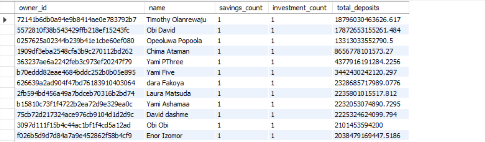
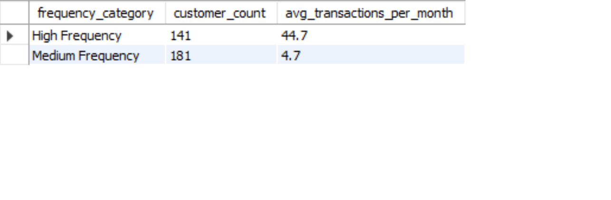
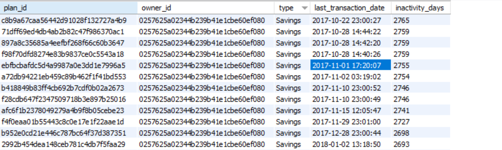
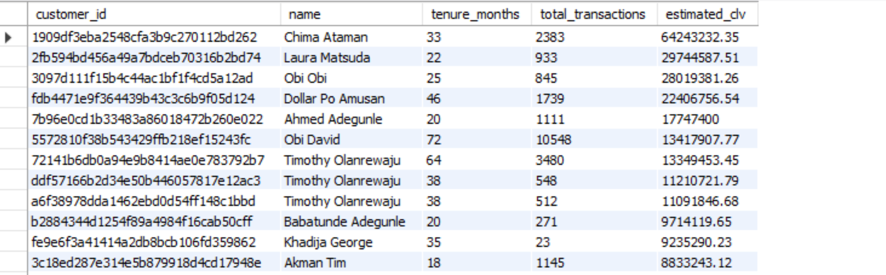

# DataAnalytics-Assessment
Cowry Data Analytics Assessment
 
# ISSUE WITH THE DATABASE.
Loading the dataset into MySQL proved to be quite challenging due to various errors that arose when attempting to import each table. One notable issue occurred with the 'customerusers' table, specifically concerning the 'email' column. The database schema had a constraint that required the values in this column to be unique. However, as I started inserting the data, I discovered that there were duplicates present in the field e.g.'chinonso+444@gmail.com' as a value that conflicted with this constraint.

To resolve this issue, I made the decision to alter the 'email' column in the 'customerusers' table. I removed the unique constraint to allow for the insertion of all values without triggering errors related to duplication. This adjustment enabled the data to be loaded successfully into the table, allowing me to proceed with my project without further interruptions.

# 1. High-Value Customers with Multiple Products

Query Explanation:

1. The Common Table Expression (CTE) "CustomerPlans" created using the 'With Clause' creates a temporary result set that:
<i>
- Combines user information with their plans and savings accounts

- For each user, calculates:
  * Number of regular savings plans they own
  * Number of investment funds they own
  * Total amount of all their deposits
- Creates a full name by combining first and last names</i>

2. The main query then:
- Filters to show only customers who have at least one savings plan AND one investment fund
- Orders results by total deposits (highest to lowest)

Example scenario:
<i>
If we have a user "John Smith" who has:
- 2 savings plans
- 1 investment fund
- Total deposits of $10,000

And "John Doe" who has:
- 1 savings plan
- 0 investment funds
- Total deposits of $5,000</i>

The query would:
<i>
- Include John Smith (because he has both types of plans)
- Exclude John Doe (because she has no investment funds)</i>

#### Observation
<i>
 <ul>
      <li>This query helps identify customers who are diversifying their portfolio with both savings and investments, ordered by their total financial commitment.</li>

<li>The query effectively answers the business question: "Who are our most valuable customers that use both savings and investment products?"</i>
</li>
 
 

# 2. Transaction Frequency Analysis

### Query Explanation:
#### Monthly Transactions Calculation:
The first CTE (monthly_transactions) breaks down transactions by customer and month

#### Customer Average Calculation:
The second CTE (customer_avg_transactions) averages these monthly counts per customer

####  Frequency Categorization: <i/>
<i>
The third CTE (frequency_categories) applies the business rules:
John with 10 transactions  "High Frequency"
Mary with 5 transactions  "Medium Frequency"
Bob with 2 transactions  "Low Frequency"</i>

#### Final Aggregation:
Groups customers by their frequency category
Counts unique customers in each category
Calculates the average transactions for each group
Example output: "High Frequency": 250 customers averaging 15.2 transactions/month "Medium Frequency": 1,200 customers averaging 5.5 transactions/month

#### Observation: 
The query directly addresses the business requirement by segmenting customers based on their transaction frequency and providing meaningful metrics for each segment.

 
 

# 3. Account Inactivity Alert

### Core Purpose Match:
<li>The query directly addresses the ops team's need to identify inactive accounts</li> 
<li>It specifically looks for accounts with no transactions for over 365 days</li>
<li>It includes both savings and investment accounts as requested</li>

### Data Flow Example:
Let's say we have these accounts:
- Account A: Last transaction 2022-01-15 (over 1 year ago)
- Account B: Last transaction 2023-09-01 (recent)
- Account C: No transactions ever (NULL)

 The query would:
<i> - Include Account A (because > 365 days)
- Exclude Account B (because < 365 days)
- Include Account C (because NULL is treated as inactive)</i>

### Key Components Alignment:
- Active accounts filter: Uses is_deleted = 0 AND is_archived = 0
- Account type identification: Uses CASE statement to label Savings/Investment
- Inactivity calculation: DATEDIFF function measures days since last transaction
- Comprehensive coverage: LEFT JOIN ensures accounts with no transactions are included

### Output Interpretation:
Using the example (1001, 305, Savings, 2023-08-10, 92):
- This shows a savings account
- Owned by user 305
- Last active on August 10, 2023
- Inactive for 92 days (though this wouldn't actually trigger the alert as it's less than 365 days)

### Observation
The query effectively translates the business requirement into a technical solution that provides actionable insights for the ops team.

 
 

# 4. Customer Lifetime Value (CLV) Estimation

For a customer like John Doe (ID 1001) who joined 24 months ago and has made 120 transactions:
If his average transaction amount is $1000, the profit per transaction would be $1 (0.1%)

### Calculation Process:
### Tenure: If John joined on Jan 1, 2022, and today is Jan 1, 2024, TIMESTAMPDIFF returns 24 months
Total Transactions: COUNT(s.id) would return 120 for John
Average Profit: For $1000 transactions, avg_profit_per_transaction would be $1

### CLV Formula Breakdown for John:
Transaction Rate per Year = (120 transactions / 24 months) * 12 = 60 transactions/year
With $1 profit per transaction
CLV = 60 * $1 = $600 per year

### The Query Features:

LEFT JOIN ensures all customers are included, even those without transactions
is_active = 1 filter ensures only active customers are analyzed
HAVING tenure_months > 0 prevents division by zero errors
GROUP BY aggregates transactions per customer

## Real-world Application:
Marketing can use this to identify high-value customers
Higher CLV might indicate customers who:
<li>Transact frequently</li>
<li>Have larger transaction amounts</li>
<li>Maintain consistent activity over time</li>
 
This matches the requirements by providing a clear view of customer value based on their transaction history and tenure, helping marketing teams prioritize customer relationships.
